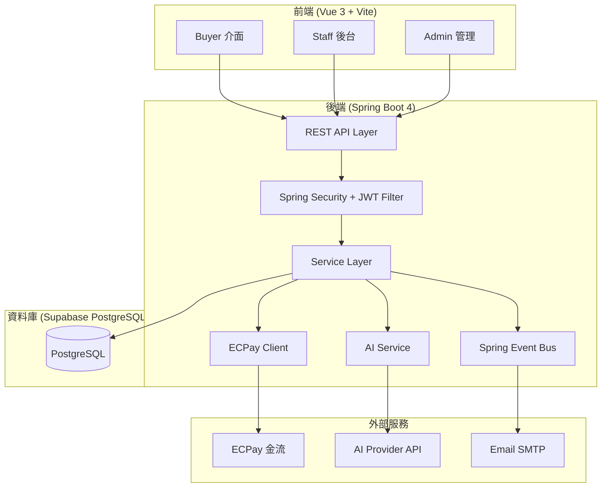
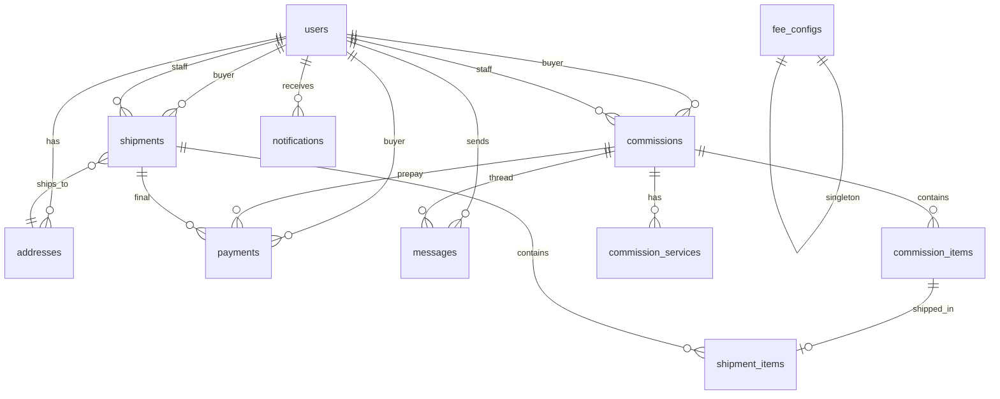
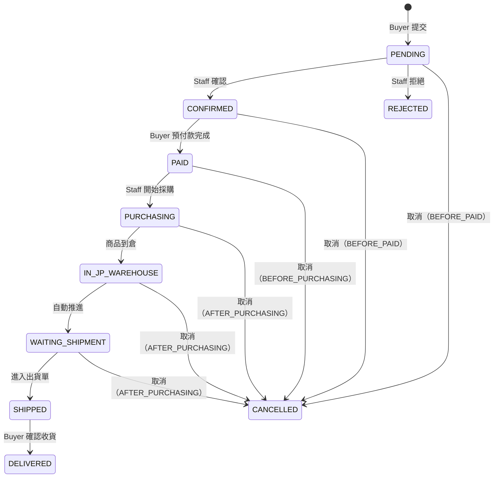
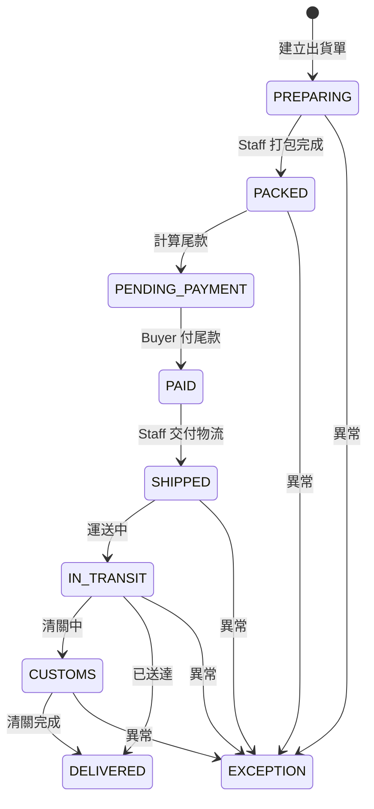
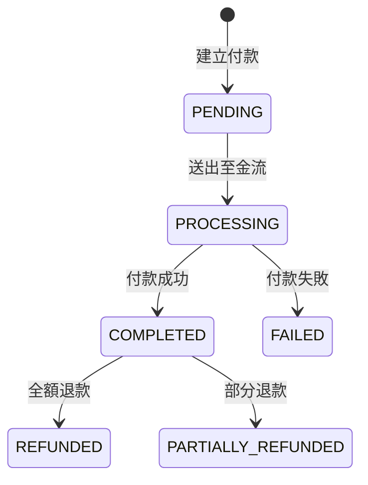

# 技術設計文件：日本代購平台（Proxy Purchase Platform）

## 概覽

本設計文件描述日本代購平台的完整技術架構，涵蓋使用者認證、委託單生命週期管理、金流整合、出貨合併、通知系統、站內訊息及 AI 輔助功能。

系統採前後端分離架構：
- 後端：Spring Boot 4.0.5 + Java 21 + Spring Data JPA + PostgreSQL（Supabase）
- 前端：Vue 3.5 + Vite 8 + Pinia + Vue Router 5
- 認證：JWT（Access Token + Refresh Token）存於 HttpOnly Cookie，Spring Security
- 金流：ECPay 整合（信用卡、ATM 虛擬帳號、超商代碼）

核心業務流程：Buyer 提交委託單 → 預付款 → Staff 代購 → 商品入倉 → 合併出貨 → 尾款付款 → 物流配送 → 完成。

---

## 架構

### 系統架構圖



### 分層架構

```
Controller Layer    → 接收 HTTP 請求、參數驗證、回傳 DTO
Service Layer       → 業務邏輯、狀態機轉換、費用計算
Repository Layer    → Spring Data JPA，資料存取
Security Layer      → JWT 簽發/驗證、RBAC 權限控制
Event Layer         → Spring ApplicationEvent，非同步通知/Email
Integration Layer   → ECPay 金流、AI Provider 整合
```

### 前端架構

```
src/
├── api/              # Axios 封裝，按模組分檔（auth.js, commission.js...）
├── composables/      # 可複用邏輯（useAuth, useNotification...）
├── components/       # 共用元件
├── layouts/          # 佈局元件（BuyerLayout, StaffLayout, AdminLayout）
├── router/           # Vue Router 路由定義 + 導航守衛
├── stores/           # Pinia stores（auth, commission, shipment...）
├── views/            # 頁面元件，按角色/功能分資料夾
│   ├── buyer/
│   ├── staff/
│   └── admin/
└── utils/            # 工具函式（日期格式化、金額格式化...）
```

---

## 元件與介面

### 後端 API 端點設計

#### 認證模組

| 方法 | 路徑 | 說明 | 權限 |
|------|------|------|------|
| POST | `/api/auth/register` | 註冊 | 公開 |
| POST | `/api/auth/login` | 登入 | 公開 |
| POST | `/api/auth/logout` | 登出（清除 Cookie） | 已認證 |
| POST | `/api/auth/refresh` | 刷新 Access Token | 公開（需 Refresh Token Cookie） |
| GET | `/api/auth/me` | 取得當前使用者資訊 | 已認證 |

#### 地址模組

| 方法 | 路徑 | 說明 | 權限 |
|------|------|------|------|
| GET | `/api/addresses` | 列出自己的地址 | BUYER |
| POST | `/api/addresses` | 新增地址 | BUYER |
| PUT | `/api/addresses/{id}` | 編輯地址 | BUYER（本人） |
| DELETE | `/api/addresses/{id}` | 軟刪除地址 | BUYER（本人） |
| PATCH | `/api/addresses/{id}/default` | 設為預設地址 | BUYER（本人） |

#### 委託單模組

| 方法 | 路徑 | 說明 | 權限 |
|------|------|------|------|
| POST | `/api/commissions` | 建立委託單（含商品項目與加值服務） | BUYER |
| GET | `/api/commissions` | 列出委託單（Buyer 看自己的，Staff/Admin 看全部） | 已認證 |
| GET | `/api/commissions/{id}` | 委託單詳情 | 已認證（資料隔離） |
| POST | `/api/commissions/{id}/submit` | 提交委託單並導向付款 | BUYER |
| PATCH | `/api/commissions/{id}/status` | 更新委託單狀態 | STAFF, ADMIN |
| POST | `/api/commissions/{id}/cancel` | 取消委託單 | BUYER, ADMIN |
| PATCH | `/api/commissions/{id}/items/{itemId}` | Staff 更新商品實際價格/重量 | STAFF, ADMIN |

#### 出貨單模組

| 方法 | 路徑 | 說明 | 權限 |
|------|------|------|------|
| GET | `/api/shipments/available-items` | 列出可出貨的商品項目 | BUYER |
| POST | `/api/shipments` | 建立出貨單（Buyer 申請） | BUYER |
| GET | `/api/shipments` | 列出出貨單 | 已認證（資料隔離） |
| GET | `/api/shipments/{id}` | 出貨單詳情 | 已認證（資料隔離） |
| PATCH | `/api/shipments/{id}/status` | 更新出貨單狀態 | STAFF, ADMIN |
| PATCH | `/api/shipments/{id}/tracking` | 填入追蹤號碼 | STAFF, ADMIN |

#### 付款模組

| 方法 | 路徑 | 說明 | 權限 |
|------|------|------|------|
| POST | `/api/payments/prepay` | 發起預付款（ECPay） | BUYER |
| POST | `/api/payments/final` | 發起尾款付款（ECPay） | BUYER |
| POST | `/api/payments/ecpay/callback` | ECPay 付款結果回呼 | 公開（驗證 CheckMacValue） |
| POST | `/api/payments/ecpay/return` | ECPay 前端導回 | 公開 |
| POST | `/api/payments/{id}/confirm` | 人工核帳 | STAFF, ADMIN |
| GET | `/api/payments` | 列出付款紀錄 | 已認證（資料隔離） |

#### 通知模組

| 方法 | 路徑 | 說明 | 權限 |
|------|------|------|------|
| GET | `/api/notifications` | 列出自己的通知（分頁） | 已認證 |
| GET | `/api/notifications/unread-count` | 未讀通知數量 | 已認證 |
| PATCH | `/api/notifications/{id}/read` | 標記已讀 | 已認證（本人） |
| PATCH | `/api/notifications/read-all` | 全部標記已讀 | 已認證 |

#### 訊息模組

| 方法 | 路徑 | 說明 | 權限 |
|------|------|------|------|
| GET | `/api/commissions/{commissionId}/messages` | 列出委託單訊息 | BUYER（本人）, STAFF, ADMIN |
| POST | `/api/commissions/{commissionId}/messages` | 傳送訊息 | BUYER（本人）, STAFF, ADMIN |
| PATCH | `/api/messages/{id}/read` | 標記已讀 | 已認證（本人） |
| DELETE | `/api/messages/{id}` | 軟刪除（撤回） | 已認證（本人） |

#### 費率管理模組

| 方法 | 路徑 | 說明 | 權限 |
|------|------|------|------|
| GET | `/api/fee-configs` | 列出所有費率 | STAFF, ADMIN |
| PUT | `/api/fee-configs/{key}` | 修改費率 | ADMIN |

#### 使用者管理模組

| 方法 | 路徑 | 說明 | 權限 |
|------|------|------|------|
| GET | `/api/admin/users` | 列出所有使用者 | ADMIN |
| PATCH | `/api/admin/users/{id}/status` | 停用/啟用使用者 | ADMIN |
| PATCH | `/api/admin/users/{id}/role` | 修改使用者角色 | ADMIN |

#### AI 輔助模組

| 方法 | 路徑 | 說明 | 權限 |
|------|------|------|------|
| POST | `/api/ai/extract-product` | 從商品連結擷取資訊 | BUYER |
| POST | `/api/ai/translate` | 日文翻譯中文 | BUYER |
| POST | `/api/ai/estimate-cost` | 費用試算 | BUYER |
| POST | `/api/ai/commission-summary` | 委託單智慧摘要 | BUYER |


### 核心 Service 元件

#### AuthService
- `register(email, password, fullName)` → 建立使用者，BCrypt 雜湊密碼
- `login(email, password)` → 驗證身份，簽發 JWT 雙 Token，設定 HttpOnly Cookie
- `refresh(refreshToken)` → 驗證 Refresh Token，簽發新 Access Token
- `logout()` → 清除 Cookie

#### CommissionService
- `create(buyerId, items, services, buyerNote)` → 建立委託單 + 商品項目 + 加值服務
- `submit(commissionId)` → 計算預付金額，產生付款請求
- `updateStatus(commissionId, newStatus, staffId)` → 狀態機轉換，驗證合法性
- `cancel(commissionId, reason, cancelledBy)` → 取消委託，計算退款金額
- `calculatePrepayAmount(commission)` → 根據費率計算預付金額明細

#### ShipmentService
- `getAvailableItems(buyerId)` → 列出 WAITING_SHIPMENT 狀態的商品
- `create(buyerId, itemIds, addressId, shippingMethod)` → 建立出貨單 + 出貨項目
- `updateStatus(shipmentId, newStatus, staffId)` → 狀態機轉換
- `calculateFinalPayment(shipmentId)` → 計算尾款（國內運費 + 國際運費 + 關稅估算）

#### PaymentService
- `createPrepayment(commissionId, paymentMethod)` → 建立預付款紀錄，呼叫 ECPay
- `createFinalPayment(shipmentId, paymentMethod)` → 建立尾款紀錄，呼叫 ECPay
- `handleECPayCallback(params)` → 驗證 CheckMacValue，更新付款狀態
- `confirmManually(paymentId, staffId)` → 人工核帳（銀行轉帳）
- `processRefund(paymentId, amount, reason)` → 退款處理

#### NotificationService
- `create(userId, type, title, content, entityType, entityId, metadata)` → 建立站內通知
- `getUnreadCount(userId)` → 未讀數量
- `markAsRead(notificationId)` → 標記已讀
- 監聽 Spring ApplicationEvent，自動發送通知與 Email

#### MessageService
- `send(commissionId, senderId, content, attachments)` → 傳送訊息，觸發通知
- `getByCommission(commissionId, pageable)` → 分頁列出訊息
- `markAsRead(messageId)` → 標記已讀
- `softDelete(messageId)` → 軟刪除（撤回）

#### FeeConfigService
- `getAll()` → 列出所有費率
- `getValue(configKey)` → 取得單一費率值
- `update(configKey, value)` → 更新費率

#### AIAssistantService
- `extractProduct(url)` → 呼叫 AI Provider 擷取商品資訊
- `translate(textJa)` → 日文翻譯中文
- `estimateCost(items, services)` → 根據費率試算費用
- `generateSummary(commissions)` → 產生委託單智慧摘要

### 安全元件

#### JwtTokenProvider
- `generateAccessToken(userId, role)` → 簽發 Access Token（30 分鐘）
- `generateRefreshToken(userId, role)` → 簽發 Refresh Token（7 天）
- `validateToken(token)` → 驗證 Token 有效性
- `getUserIdFromToken(token)` → 從 Token 取得 user_id
- `getRoleFromToken(token)` → 從 Token 取得 role

#### JwtAuthenticationFilter
- 繼承 `OncePerRequestFilter`
- 從 HttpOnly Cookie 取得 Access Token
- 驗證 Token 並設定 `SecurityContextHolder`
- Access Token 過期時自動嘗試用 Refresh Token 刷新

#### SecurityConfig
- 配置 Spring Security filter chain
- 公開路徑：`/api/auth/**`、`/api/payments/ecpay/callback`
- RBAC 路徑規則對應權限矩陣
- CORS 設定允許前端 origin
- CSRF 停用（使用 JWT + HttpOnly Cookie + SameSite=Strict）

### ECPay 整合元件

#### ECPayService
- `createPaymentForm(payment)` → 產生 ECPay 付款表單參數（含 CheckMacValue）
- `verifyCallback(params)` → 驗證 ECPay 回呼的 CheckMacValue
- `parseCallbackResult(params)` → 解析回呼結果，更新付款狀態
- 支援付款方式：`Credit`（信用卡）、`ATM`（虛擬帳號）、`CVS`（超商代碼）

### 前端核心元件

#### Pinia Stores
- `useAuthStore` → 使用者狀態、登入/登出、Token 刷新
- `useCommissionStore` → 委託單 CRUD、狀態篩選
- `useShipmentStore` → 出貨單管理
- `useNotificationStore` → 通知列表、未讀數量、輪詢
- `useMessageStore` → 訊息列表、傳送

#### Vue Router 導航守衛
- `beforeEach` → 檢查認證狀態，未登入導向登入頁
- 角色路由守衛 → Buyer 不可進入 Staff/Admin 路由，反之亦然
- 路由 meta 標記 `requiredRole`

---

## 資料模型

### 資料庫 ER 圖



### 資料表概覽

系統共 11 張資料表、13 個 ENUM 型別，完整定義參見 `DB-代購平台.md`。

| 資料表 | 說明 | 主要關聯 |
|--------|------|----------|
| `users` | 使用者（Buyer/Staff/Admin） | 所有表的 FK 來源 |
| `addresses` | 收件地址 | users → addresses |
| `commissions` | 委託單（核心） | users, commission_items, commission_services |
| `commission_items` | 委託商品項目 | commissions → commission_items |
| `commission_services` | 加值服務 | commissions → commission_services |
| `shipments` | 出貨單 | users, addresses, shipment_items |
| `shipment_items` | 出貨商品項目 | shipments, commission_items, commissions |
| `payments` | 付款紀錄 | commissions（PREPAY）, shipments（FINAL）, users |
| `notifications` | 站內通知 | users，多型關聯（entity_type + entity_id） |
| `messages` | 站內訊息 | commissions, users |
| `fee_configs` | 費率設定 | 獨立表，config_key 為 PK |

### 狀態機定義

#### 委託單狀態機（commission_status）



#### 出貨單狀態機（shipment_status）



#### 付款狀態機（payment_status）



### 後端 JPA Entity 對應

所有 Entity 使用 Lombok `@Data`，UUID 主鍵，`@CreationTimestamp` / `@UpdateTimestamp` 自動管理時間戳。ENUM 使用 `@Enumerated(EnumType.STRING)` 對應 PostgreSQL ENUM 型別。

JSONB 欄位（如 `specifications`、`gateway_response`、`atm_info`、`attachments`、`metadata`）使用 `@JdbcTypeCode(SqlTypes.JSON)` 搭配 `Map<String, Object>` 或 `List<String>` 映射。

### 費用計算邏輯

#### 預付金額計算（PREPAY）

```
商品費（TWD）= Σ(商品估價 JPY × 數量) × 匯率
服務費 = MAX(商品費 × SERVICE_FEE_RATE, SERVICE_FEE_MIN)
檢品費 = 商品費 >= FREE_INSPECTION_THRESHOLD ? 0 : 檢品項目數 × INSPECTION_FEE_PER_ITEM
預付總額 = 商品費 + 服務費 + 檢品費
```

#### 尾款計算（FINAL）

```
日本境內運費 = DOMESTIC_SHIPPING_JP_FLAT × 委託單數
國際運費 = 總重量(kg) × 運費費率（依運送方式）
關稅估算 = 商品費 × CUSTOMS_ESTIMATE_RATE
尾款總額 = 日本境內運費 + 國際運費 + 關稅估算
```


---

## 正確性屬性（Correctness Properties）

*正確性屬性是一種在系統所有合法執行中都應成立的特徵或行為——本質上是對系統應做之事的形式化陳述。屬性作為人類可讀規格與機器可驗證正確性保證之間的橋樑。*

### Property 1：密碼雜湊往返（Password Hash Round-Trip）

*對於任意*有效的密碼字串，經 BCrypt 雜湊後儲存的 password_hash 應滿足：(1) hash 不等於原始密碼，(2) BCrypt.matches(原始密碼, hash) 回傳 true。

**驗證：需求 1.1**

### Property 2：JWT Payload 正確性

*對於任意*已註冊的使用者（任意 role），登入後簽發的 Access Token 解碼後，payload 中的 user_id 應等於該使用者的 id，role 應等於該使用者的 role。

**驗證：需求 1.2**

### Property 3：RBAC 權限矩陣一致性

*對於任意*角色（BUYER / STAFF / ADMIN）與任意 API 端點的組合，存取結果（允許或拒絕）應與權限矩陣定義一致：未授權的操作回傳 HTTP 403，已授權的操作正常執行。

**驗證：需求 1.1.1, 1.1.2, 1.1.4**

### Property 4：Buyer 資料隔離

*對於任意*兩個不同的 Buyer（A 和 B），Buyer A 不應能透過 API 存取 Buyer B 的委託單、出貨單、通知或訊息資料。

**驗證：需求 1.1.3**

### Property 5：預設地址唯一性不變量

*對於任意* Buyer 和任意地址操作序列（新增、設預設、刪除），在任何時刻該 Buyer 的 is_default=true 且 is_deleted=false 的地址最多只有一個。

**驗證：需求 2.3, 2.4**

### Property 6：地址必填欄位驗證

*對於任意*地址資料，若缺少任一必填欄位（recipient_name、phone、postal_code、city、district、address_line），建立地址的請求應被拒絕。

**驗證：需求 2.2**

### Property 7：委託單商品項目驗證

*對於任意*委託單建立請求，若商品項目列表為空，或任一商品項目的 quantity ≤ 0 或缺少 product_url，該請求應被拒絕。

**驗證：需求 3.1**

### Property 8：預付金額計算正確性

*對於任意*商品項目組合（隨機價格、數量）和任意費率設定，預付總額應等於：商品費(TWD) + MAX(商品費 × SERVICE_FEE_RATE, SERVICE_FEE_MIN) + 檢品費，其中檢品費 = 商品費 ≥ FREE_INSPECTION_THRESHOLD ? 0 : 檢品項目數 × INSPECTION_FEE_PER_ITEM。

**驗證：需求 3.5, 12.3**

### Property 9：預付款紀錄唯一性

*對於任意*委託單，嘗試建立第二筆 PREPAY 類型的 Payment 紀錄應被拒絕（UNIQUE constraint on commission_id + payment_type）。

**驗證：需求 3.10**

### Property 10：委託單狀態機合法轉換

*對於任意*委託單和任意狀態轉換請求，只有符合狀態機定義的合法轉換才應被允許（PENDING→CONFIRMED、CONFIRMED→PAID、PAID→PURCHASING、PURCHASING→IN_JP_WAREHOUSE、IN_JP_WAREHOUSE→WAITING_SHIPMENT、WAITING_SHIPMENT→SHIPPED、SHIPPED→DELIVERED，以及任意狀態→CANCELLED）。非法轉換應被拒絕。

**驗證：需求 4.1, 4.3, 4.4, 5.6, 6.1, 6.4, 6.6**

### Property 11：狀態變更觸發通知

*對於任意*委託單或出貨單的狀態變更事件，系統應在 notifications 表建立一筆對應的通知紀錄，且 user_id 為該委託單的 buyer_id。

**驗證：需求 4.5, 8.1**

### Property 12：可出貨商品查詢正確性

*對於任意* Buyer 擁有的多筆不同狀態的委託單，查詢可出貨商品 API 回傳的結果應僅包含狀態為 WAITING_SHIPMENT 的委託商品，且不包含其他狀態的商品。

**驗證：需求 5.1**

### Property 13：出貨商品項目唯一性

*對於任意* Commission_Item，若已被加入一張出貨單，嘗試將其加入另一張出貨單應被拒絕。

**驗證：需求 5.5**

### Property 14：尾款計算正確性

*對於任意*出貨單的總重量、運送方式和費率設定，尾款總額應等於：DOMESTIC_SHIPPING_JP_FLAT × 涉及委託單數 + 總重量(kg) × 運費費率(依運送方式) + 商品費 × CUSTOMS_ESTIMATE_RATE。

**驗證：需求 6.2**

### Property 15：取消退款正確性

*對於任意*已付款的委託單和任意取消階段：(1) PAID 狀態取消時，cancel_stage 應為 BEFORE_PURCHASING，退款金額 = 預付金額 × (1 - CANCEL_FEE_RATE_AFTER_PAID)；(2) PURCHASING 及之後狀態取消時，cancel_stage 應為 AFTER_PURCHASING；(3) 取消後 cancel_reason 和 cancelled_at 不為 null。

**驗證：需求 7.1, 7.2, 7.3, 7.4**

### Property 16：未讀通知計數正確性

*對於任意*使用者和任意通知集合（部分已讀、部分未讀），未讀通知數量 API 回傳的值應等於該使用者 is_read=false 的通知紀錄數。

**驗證：需求 8.3**

---

## 錯誤處理

### HTTP 錯誤碼規範

| 狀態碼 | 使用場景 |
|--------|----------|
| 400 Bad Request | 參數驗證失敗（缺少必填欄位、格式錯誤、quantity ≤ 0） |
| 401 Unauthorized | 未攜帶有效 JWT、Token 過期 |
| 403 Forbidden | 角色權限不足、存取他人資料 |
| 404 Not Found | 資源不存在 |
| 409 Conflict | 重複註冊 Email、重複建立預付款、Commission_Item 已在出貨單中 |
| 422 Unprocessable Entity | 非法狀態轉換（如 PENDING → PURCHASING） |
| 500 Internal Server Error | 未預期的伺服器錯誤 |

### 統一錯誤回應格式

```json
{
  "error": {
    "code": "DUPLICATE_EMAIL",
    "message": "該 Email 已被註冊",
    "details": {}
  }
}
```

### 錯誤處理策略

- 使用 `@RestControllerAdvice` 全域例外處理器
- 自定義業務例外類別：`BusinessException`、`UnauthorizedException`、`ForbiddenException`、`InvalidStateTransitionException`
- ECPay 回呼驗證失敗：記錄 log 並回傳 `0|ErrorMessage`（ECPay 規範）
- AI 服務呼叫失敗：回傳降級結果（空資料 + 提示訊息），不阻斷主流程
- 資料庫 UNIQUE constraint 違反：捕獲 `DataIntegrityViolationException`，轉換為 409 回應

### 前端錯誤處理

- Axios 攔截器統一處理 401（自動刷新 Token 或導向登入頁）
- 403 顯示「權限不足」提示
- 網路錯誤顯示重試提示
- 表單驗證錯誤即時顯示於對應欄位

---

## 測試策略

### 測試框架與工具

- 後端單元測試：JUnit 5 + Mockito
- 後端屬性測試：jqwik（Java property-based testing library）
- 後端整合測試：Spring Boot Test + Testcontainers（PostgreSQL）
- 前端單元測試：Vitest
- 前端元件測試：Vue Test Utils
- API 測試：REST Assured

### 屬性測試（Property-Based Testing）

每個正確性屬性對應一個 jqwik 屬性測試，最少執行 100 次迭代。

測試標記格式：`Feature: proxy-purchase-platform, Property {number}: {property_text}`

重點屬性測試：
- Property 8（預付金額計算）：生成隨機商品價格（1～100000 JPY）、數量（1～10）、費率，驗證計算公式
- Property 10（狀態機合法轉換）：生成隨機的 (當前狀態, 目標狀態) 組合，驗證合法性判斷
- Property 14（尾款計算）：生成隨機重量（100～30000g）、運送方式、費率，驗證計算公式
- Property 15（取消退款）：生成隨機的委託單狀態和預付金額，驗證退款金額和 cancel_stage

### 單元測試

重點覆蓋：
- Service 層業務邏輯（狀態轉換、費用計算、退款計算）
- JWT 簽發與驗證
- ECPay CheckMacValue 產生與驗證
- 輸入驗證邏輯（地址必填欄位、委託單商品項目）

### 整合測試

使用 Testcontainers 啟動 PostgreSQL 容器：
- API 端點的完整請求/回應驗證
- RBAC 權限矩陣驗證
- 資料庫 UNIQUE constraint 驗證
- ECPay 回呼處理流程（mock ECPay）

### 前端測試

- Pinia Store 單元測試（mock API）
- Vue Router 導航守衛測試
- 關鍵表單元件測試（委託單建立、地址管理）
- API 攔截器測試（Token 刷新、錯誤處理）
